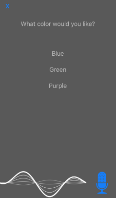

# Voice Requests

## Basics

The user speech-end of a SayKit app revolves around the `SAYVoiceRequest` class. A **Voice Request** encapsulates the entire "question-answer" process of a dialogue turn: everything between a asking the user a question to triggering an action in response to their answer.

// TODO: add figure depicting scenarios for sample requests

For example, if the application needs to ask the user for permission to do something, it can create a `SAYConfirmationRequest`, like so:

````swift
let request = SAYConfirmationRequest(promptText: "Are you sure?") { doIt: Bool in
	if doIt { /* do it! */ }
	else    { /* don't do it */ }
}
````

If the app needs the user to choose a color for the shirt she just added to her cart, it can use a `SAYSelectRequest`:

````swift
let request = SAYSelectRequest(
    itemLabels: ["Small", "Medium", "Large"],
    promptText: "What color would you like?") { result in
        // add it to the cart with the given color choice
    }
````

Many voice requests have supplemental visual controls that are automatically presented to the screen when a question is asked. In the case of the select request above, a set of tappable buttons will appear on screen, one per option.



SayKit provides many pre-built requests like these, but voice requests are versitile. They can be extended to provide customized speech interpretation, they be chained together to provide continuous back-and-forth dialogues, their visual components can be customized, and much more. To learn about these features, let's peek under the hood of the voice request system.

## Voice Request Flow

Each voice request session has 4 stages:

1. **Prompting** (optional): The app prompts the user for some speech, typically with a question. This may also include presenting visual controls to support touch responses.
2. **Speech recognition**: The microphone activates and accepts user speech. That speech is transformed into meaningful data, typically a string.
3. **Interpretation**: The speech string is interpreted into a useful value. For example, the `SAYConfirmationRequest` transforms the string into a `Bool` value. If no value could be interpreted, a validation error is produced instead.
4. **Response**: The application decides what to do with the interpreted value (or validation error). This could take the form of spoken feedback, arbitrary application code, or even the transition to another voice request.

// turn-taking support, supplemental visual controls

[Next - Command Recognition >>](./03-command-recognition.md)
