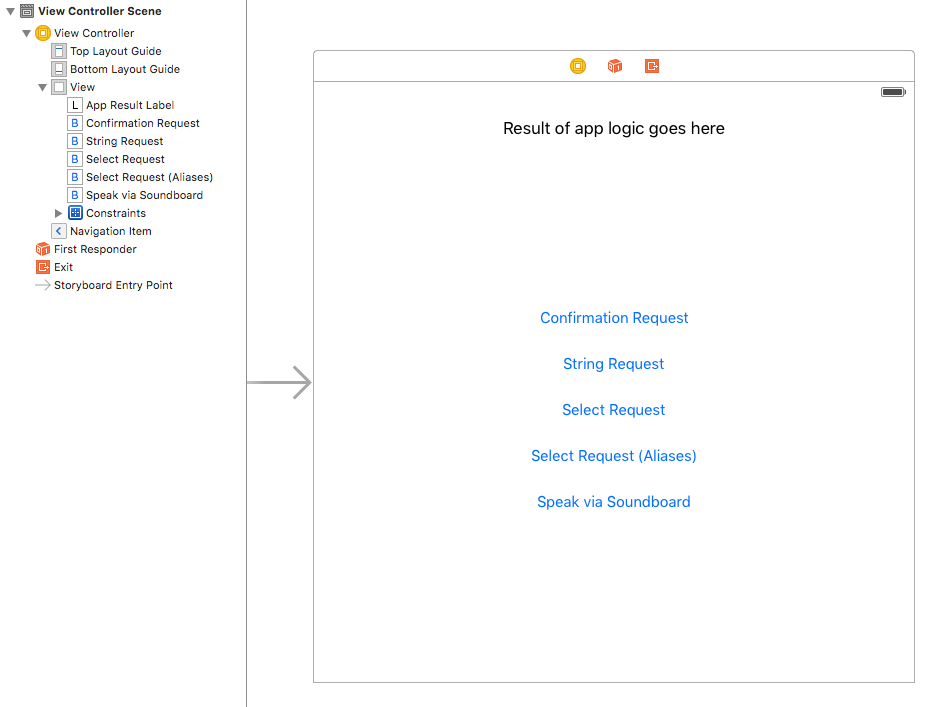

# Setup
In visual apps, we use `AppDelegate`'s `application:didFinishLaunchingWithOptions:` method to initialize our graphical user interface, all contained within a `UIWindow`. This is also a great place to set up SayKit's conversational equivalent, the `SAYConversationManager`.

## GUI Setup

The first thing we’ll do is add a UILabel as a quick way for us to get feedback on what the app's doing. In these examples, you'll see us finish our conversations with anticlimactic calls to `updateAppResultLabelWithText:`. This is where your app's logic would take over and do something amazing!

The rest of the GUI will be a series of UIButtons that we'll use to start sample voice requests.

Finally, we need one last button that the user can tap to begin talking to the app. Luckily for us, SayKit comes with a pre-packaged microphone button as part of the `SAYCommandBarController` container class. All we need to do is set our `ViewController` as the content of a Command Bar Controller.



Let’s get started!

- Create a new single-view application
- Add the SayKit framework, following the [Getting Started instructions](#)
- Setup the GUI like in the image above. We'll hook up the buttons' IBActions shortly.
- In `AppDelegate.m`, setup a `SAYCommandBarController` as the window's root view controller. The `SAYCommandBarController` behaves like a container view controller similar to a `UITabBarController`. In this case, the `contentViewController` is our `ViewController`.

    ```swift
    func application(application: UIApplication, 
        didFinishLaunchingWithOptions launchOptions: [NSObject: AnyObject]?) -> Bool {
        
            /* ...setup Conversation Manager (see below)... */

            // Initialize GUI
            window = UIWindow(frame: UIScreen.mainScreen().bounds)
            let storyboard = UIStoryboard(name: "Main", bundle: nil)
            let viewController = storyboard.instantiateInitialViewController()
            
            // Wrap initial view controller in a command bar controller
            let commandBarController = SAYCommandBarController()
            commandBarController.contentViewController = viewController
            
            window?.rootViewController = commandBarController
            window?.makeKeyAndVisible()

            return true
    }
    ```

## Conversation Manager Setup

The `SAYConversationManager` oversees the highest level of a conversation, coordinating input (listening) and output (speaking). To do its job, we have to define its `commandRegistry` and at least one `audioSource`, which are involved in the input and output aspects of a conversation, respectively.

In this example, we'll use the simplest stand-ins for these properties. (Later on, we'll show how a Conversation Topic can fill both these roles.) A `SAYCommandRecognizerCatalog` stores a flat array of `SAYCommandRecognizer`s that we'll populate shortly. A `SAYSoundBoard` is an implementation of an audio source (`SAYAudioEventSource`) that enables the Conversation Manager to post audio events.

The last line is an optional optimization that improves the performance of calls to the standard speech recognition service.

```swift
func application(application: UIApplication, didFinishLaunchingWithOptions launchOptions: [NSObject: AnyObject]?) -> Bool {
    
    // Initial setup of the SAYConversationManager
    let catalog = SAYCommandRecognizerCatalog()
    SAYConversationManager.systemManager().commandRegistry = catalog
    
    let soundBoard = SAYSoundBoard()
    SAYConversationManager.systemManager().addAudioSource(soundBoard, forTrack:SAYAudioTrackMainIdentifier)
    
    // Optional optimization
    SAYAPIKeyManager.sharedInstance().prefetchAPIKeys()
    
    /* ...setup GUI... */

    return true
}
```

Now that we're all set up, let's get to the real meat of a conversational interface: command recognizers and voice requests!

[Next - Command Recognizers >>](./02-command-recognizers.md)