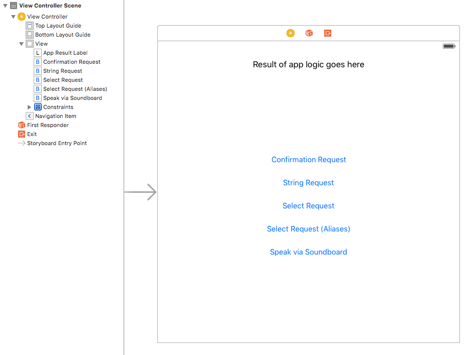

# Setup
In visual apps, we use `AppDelegate`'s `application:didFinishLaunchingWithOptions:` method to initialize our graphical user interface, all contained within a `UIWindow`. This is also a great place to set up SayKit's conversational equivalent, the `SAYConversationManager`.

First we'll create a simple GUI to run our demo, then configure our `SAYConversationManager.

## GUI Setup

The first thing we’ll do is add a UILabel as a quick way for us to get feedback on what the app's doing. In these examples, you'll see us finish our conversations with anticlimactic calls to [`presentResultText:`](#soundboard), which updates the label's text and speaks a message. This is where your app's logic would take over and do something amazing!

The rest of the GUI will be a series of UIButtons that we'll use to start sample voice requests.

Finally, we need one last button that the user can tap to begin talking to the app. Luckily for us, SayKit comes with a pre-packaged microphone button as part of the `SAYCommandBarController` container class. We'll make this container the root view controller of the application, and set our `ViewController` as the content of a Command Bar Controller.



Let’s get started!

- Create a new single-view application
- Add the SayKit framework, following the [Installation Guide](https://github.com/ConversantLabs/SayKitSDK/blob/master/README.md#installation-guide)
- Setup the GUI like in the image above. We'll hook up the buttons' IBActions shortly.
- In `AppDelegate.m`, setup a `SAYCommandBarController` as the window's root view controller. The `SAYCommandBarController` behaves like a container view controller similar to a `UITabBarController`. In this case, the `contentViewController` is our `ViewController`.

    ```swift
    func application(application: UIApplication, 
        didFinishLaunchingWithOptions launchOptions: [NSObject: AnyObject]?) -> Bool {
        
            /* ...setup Conversation Manager (see below)... */

            // Grab the initial view controller set up by the storyboard
            window = UIWindow(frame: UIScreen.mainScreen().bounds)
            let storyboard = UIStoryboard(name: "Main", bundle: nil)
            let viewController = storyboard.instantiateInitialViewController()
            
            // Wrap initial view controller in a command bar controller
            let commandBarController = SAYCommandBarController()
            commandBarController.contentViewController = viewController
            
            window?.rootViewController = commandBarController
            window?.makeKeyAndVisible()

            return true
    }
    ```

## Conversation Manager Setup

The `SAYConversationManager` integrates all the core components involved in both the input (listening) and output (speaking) of its conversational interface. To do its job, we have to define its `commandRegistry` (conforming to the `SAYVerbalCommandRegistry` protocol) and at least one `audioSource` (conforming to the `SAYAudioEventSource` protocol), which are involved in the input and output aspects of a conversation, respectively.

In this example, we'll use the simplest classes that conform to these roles:

- A `SAYCommandRecognizerCatalog` stores a flat array of `SAYCommandRecognizer`s that we'll populate shortly. 
- A `SAYSoundBoard` is a basic audio source that posts individual audio events (e.g. speech utterances, sound clips). It provides an easy way to present feedback to the user.

These two classes will often be the only backbone your conversation manager needs. (Later on, we'll show how a Conversation Topic can fill both these roles for more complex apps).

The last line is an optional optimization that improves the performance of calls to the standard speech recognition service. Feel free to ignore it for now.

```swift
func application(application: UIApplication, didFinishLaunchingWithOptions launchOptions: [NSObject: AnyObject]?) -> Bool {
    
    // Initial setup of the SAYConversationManager
    let catalog = SAYCommandRecognizerCatalog()
    SAYConversationManager.systemManager().commandRegistry = catalog
    
    let soundBoard = SAYSoundBoard()
    SAYConversationManager.systemManager().addAudioSource(soundBoard, forTrack:SAYAudioTrackMainIdentifier)
    
    // Optional optimization
    SAYAPIKeyManager.sharedInstance().prefetchAPIKeys()
    
    /* ...setup GUI... */

    return true
}
```

## SoundBoard

For many apps, `SAYSoundBoard`'s `speakText:` method will be the primary way your app responds to the user. Let's create a helper method both speak our feedback to the user and update the `appResultsLabel` label.

```swift
// ViewController.swift
private func presentResultText(text: String)
{
    dispatch_async(dispatch_get_main_queue()) {
        self.appResultLabel.text = text
    }
    
    soundBoard?.speakText(text)
}
```

We've also hooked up a "Hello world!" button:

```swift
// ViewController.swift
@IBAction func soundBoardButtonTapped(sender: AnyObject)
{
    presentResultText("Hello world!")
}
```

This assumes you kept a handle on the sound board used in initializing our Conversation Manager's audio source, perhaps through a property on `ViewController`:

```swift
// ViewController.swift
class ViewController: UIViewController {
    // ...
    var soundBoard: SAYSoundBoard?
    // ...
}
```

```swift
// AppDelegate.swift, application:didFinishLaunchingWithOptions:

// ...
let soundBoard = SAYSoundBoard()
SAYConversationManager.systemManager().addAudioSource(soundBoard, forTrack:SAYAudioTrackMainIdentifier)
// ...
let viewController = storyboard.instantiateInitialViewController() as! ViewController
viewController.soundBoard = soundBoard
// ...
```

____


Now that we're all set up, let's get to the real meat of a conversational interface: voice requests and command recognizers!

[Next - Voice Requests >>](./02-voice-requests.md)
